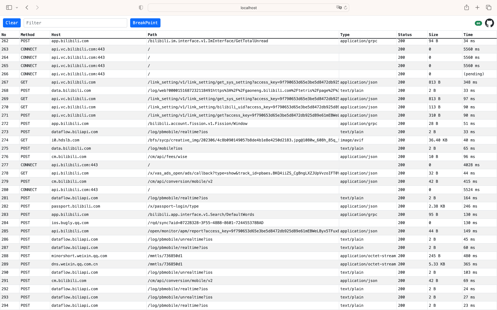
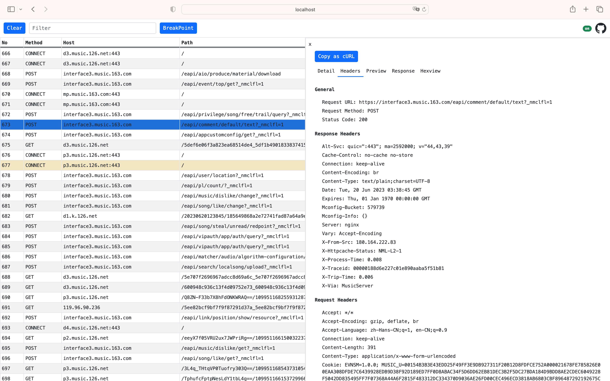
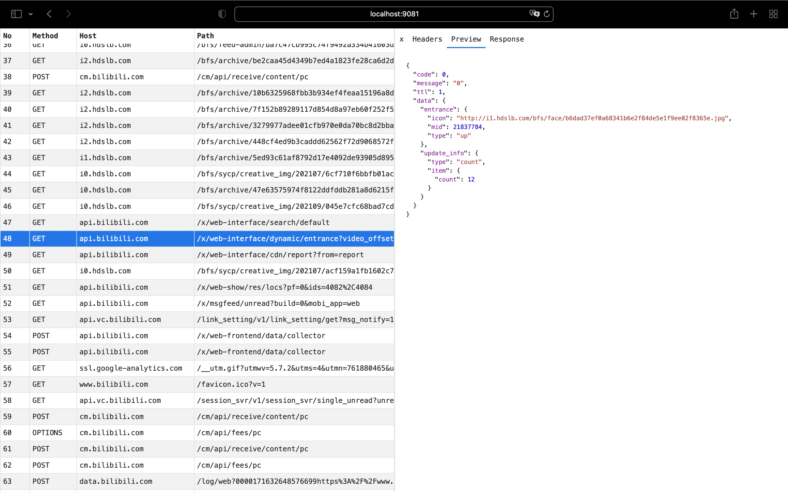

# go-mitmproxy

[简体中文](./README_CN.md)

`go-mitmproxy` is a Golang implementation of [mitmproxy](https://mitmproxy.org/) that supports man-in-the-middle attacks and parsing, monitoring, and tampering with HTTP/HTTPS traffic.

## Key features

- Parses HTTP/HTTPS traffic and displays traffic details via a [web interface](#web-interface).
- Supports a [plugin mechanism](#adding-functionality-by-developing-plugins) for easily extending functionality. Various event hooks can be found in the [examples](./examples) directory.
- HTTPS certificate handling is compatible with [mitmproxy](https://mitmproxy.org/) and stored in the `~/.mitmproxy` folder. If the root certificate is already trusted from a previous use of `mitmproxy`, `go-mitmproxy` can use it directly.
- Map Remote and Map Local support.
- HTTP/2 support.
- Refer to the [configuration documentation](#additional-parameters) for more features.

## Unsupported features

- Only supports setting the proxy manually in the client, not transparent proxy mode.
- Currently does not support WebSocket protocol parsing.

> For more information on the difference between manually setting a proxy and transparent proxy mode, please refer to the mitmproxy documentation for the Python version: [How mitmproxy works](https://docs.mitmproxy.org/stable/concepts-howmitmproxyworks/). go-mitmproxy currently supports "Explicit HTTP" and "Explicit HTTPS" as mentioned in the article.

## Command Line Tool

### Installation

```bash
go install github.com/lqqyt2423/go-mitmproxy/cmd/go-mitmproxy@latest
```

### Usage

Use the following command to start the go-mitmproxy proxy server:

```bash
go-mitmproxy
```

After starting, the HTTP proxy address is set to port 9080 by default, and the web interface is set to port 9081 by default.

The certificate needs to be installed after the first startup to parse HTTPS traffic. The certificate will be automatically generated after the first startup command and stored in `~/.mitmproxy/mitmproxy-ca-cert.pem`. Installation steps can be found in the Python mitmproxy documentation: [About Certificates](https://docs.mitmproxy.org/stable/concepts-certificates/).

### Additional Parameters

ou can use the following command to view more parameters of go-mitmproxy:

```bash
go-mitmproxy -h
```

```txt
Usage of go-mitmproxy:
  -addr string
    	proxy listen addr (default ":9080")
  -allow_hosts value
    	a list of allow hosts
  -cert_path string
    	path of generate cert files
  -debug int
    	debug mode: 1 - print debug log, 2 - show debug from
  -f string
    	Read configuration from file by passing in the file path of a JSON configuration file.
  -ignore_hosts value
    	a list of ignore hosts
  -map_local string
    	map local config filename
  -map_remote string
    	map remote config filename
  -ssl_insecure
    	not verify upstream server SSL/TLS certificates.
  -upstream string
    	upstream proxy
  -upstream_cert
    	connect to upstream server to look up certificate details (default true)
  -version
    	show go-mitmproxy version
  -web_addr string
    	web interface listen addr (default ":9081")
```

## Importing as a package for developing functionalities

### Simple Example

```golang
package main

import (
	"log"

	"github.com/lqqyt2423/go-mitmproxy/proxy"
)

func main() {
	opts := &proxy.Options{
		Addr:              ":9080",
		StreamLargeBodies: 1024 * 1024 * 5,
	}

	p, err := proxy.NewProxy(opts)
	if err != nil {
		log.Fatal(err)
	}

	log.Fatal(p.Start())
}
```

### Adding Functionality by Developing Plugins

Refer to the [examples](./examples) for adding your own plugins by implementing the `AddAddon` method.

The following are the currently supported event nodes:

```golang
type Addon interface {
	// A client has connected to mitmproxy. Note that a connection can correspond to multiple HTTP requests.
	ClientConnected(*ClientConn)

	// A client connection has been closed (either by us or the client).
	ClientDisconnected(*ClientConn)

	// Mitmproxy has connected to a server.
	ServerConnected(*ConnContext)

	// A server connection has been closed (either by us or the server).
	ServerDisconnected(*ConnContext)

	// The TLS handshake with the server has been completed successfully.
	TlsEstablishedServer(*ConnContext)

	// HTTP request headers were successfully read. At this point, the body is empty.
	Requestheaders(*Flow)

	// The full HTTP request has been read.
	Request(*Flow)

	// HTTP response headers were successfully read. At this point, the body is empty.
	Responseheaders(*Flow)

	// The full HTTP response has been read.
	Response(*Flow)

	// Stream request body modifier
	StreamRequestModifier(*Flow, io.Reader) io.Reader

	// Stream response body modifier
	StreamResponseModifier(*Flow, io.Reader) io.Reader
}
```

## WEB Interface

You can access the web interface at http://localhost:9081/ using a web browser.

### Features

- View detailed information of HTTP/HTTPS requests
- Supports formatted preview of JSON requests/responses
- Supports binary mode to view response body
- Supports advanced filtering rules
- Supports request breakpoint function

### Screenshot Examples







### Sponsor Me

If you find this project helpful, consider buying me a cup of coffee.

When sponsoring, you can add a note stating the source as "go-mitmproxy," and I will add you to the sponsorship list below.

<div align="center">
	
</div>

Thank you to the following sponsors:

None at the moment.

## License

[MIT License](./LICENSE)
